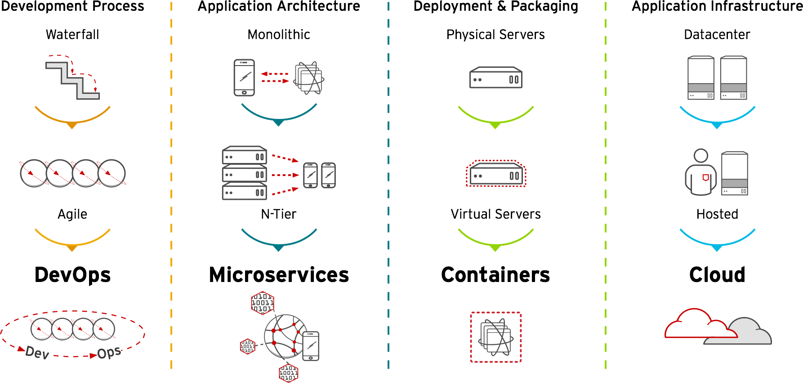
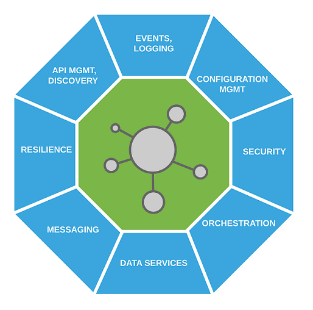
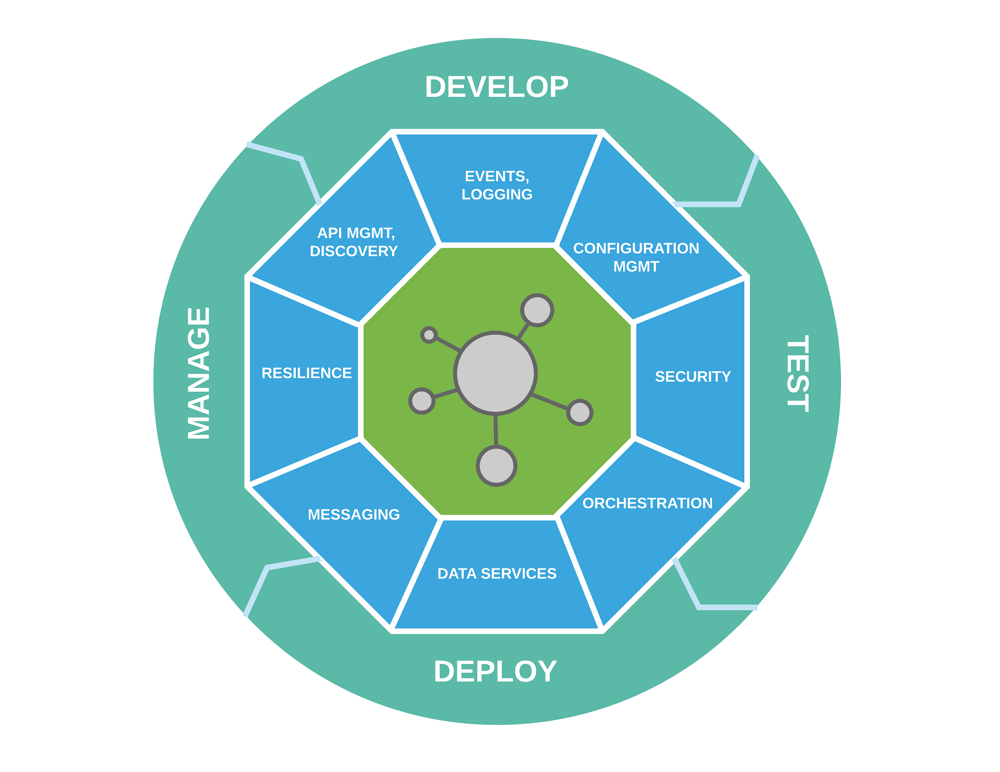
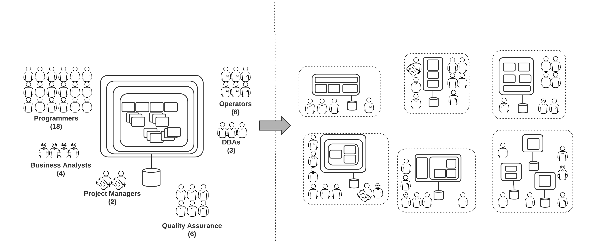

# 使用Red Hat应用程序运行时和OpenShift实现应用程序现代化

## 微服务体系结构概述和原则

### 关键技术发展趋势 

### 微服务定义

“[微服务是]“……一种将单个应用程序开发为一套小型服务的方法，每个服务运行在**自己的进程**中，并采用**轻量级通信机制**(通常是HTTP API资源)。这些服务是围绕业务功能构建的，可以通过**完全自动化**的部署机制**独立部署**。这些服务最起码是**集中化**管理的，它们可以用**不同的编程语言**编写，使用不同的数据存储技术。

—— Martin Fowler

### 微服务与单体应用程序

单体应用把所有功能放在单个处理线程中，通过在多个服务中部署副本来进行应用扩展。

微服务架构把每个功能组件放在不同的服务中，通过跨服务器的分布式服务灵活地扩展应用。

### 微服务解构

#### 核心内容

- 定义良好
- 单一目的专用
- 松散耦合
- 领域建模/领域驱动设计的结果

#### 实现和运行时

- 多语言支持
- 轻量级运行时
- 以容器镜像做为包装和交付的对象

#### 平台和管理

- 一致性
- 可重用性
- 将应用程序逻辑与基础设施服务分离
- 可重复的架构模式和工具

#### 应用程序生命周期管理

- 桌面数据中心
- 可定制的管道
- 一致的过程

### 为什么采用微服务?

#### 更快的部署

- 单体应用通常需要更复杂的构建和测试后才能进入生产
- 微服务更小，更容易测试，更容易打包到容器中
- 独立发布的小型服务缩短了修复缺陷和将新特性引入生产所需的时间

#### 更快的开发

- 独立的和成组的微服务可以由小团队开发、管理和运维(团队人员规模大概一顿饭分享两个披萨饼管饱（^_^），详见two-pizza team概念)
- 协作已经成为大型团队的瓶颈(大于 8-10人)
- 使用微服务，团队可以保持小而专注

#### 不太复杂的代码

- 维护大型的单体应用程序很困难并且耗时巨大
- 即使是很小的代码更改也可能需要数周或数月才能投入生产
- 使用微服务，每个服务都可以作为单独的实体来处理
  - 可以单独测试
  - 可以有独立的发布时间表
- 微服务更容易理解和监督
- 减少对“明星”程序员的依赖，他们只是理解单体应用程序的人

#### 更容易和划算地扩展

- 小型的、无状态的微服务比有状态的单体应用程序更容易扩展
- 服务可以独立扩展
- 通常基于低成本开源组件或没有许可证成本

### 微服务的缺点

- 敏捷性和操作复杂性之间需要做个权衡
- 构建大型分布式系统是困难的
- 并不是所有的组织都能提供所需的技能和人才，盲目会导致失败
- 在分布式系统中，维护数据一致性是很困难的
- 监视和应用程序性能管理(APM)工具需要迎头赶上
- 异构语言、框架和数据存储的挑战
- 基于事件、异步和响应式编程仍处于起步阶段，拥有相关技能的人非常少

### 微服务体系架构的原则

#### 有界上下文

- 域建模
  - 代码的大小或行数不是标准
  - 重用也不是目标
- 封装单个域的细节，并定义与其他有界上下文的集成点
  - 目标：高内聚、低耦合
- 例如：电子商务应用中的客户域
  - 定义有界域上下文：订单、供货、账单
  - 在不同的情况下需要客户数据：
    - 订单：客户奖励计划状态
    - 供货：客户的交货地址和首选的运输服务
    - 账单：客户的账单地址和税率
- 每个有界上下文转换为一个或多个微服务
- 每个有界上下文维护从有界域模型派生的数据模型
- 单体/面向服务的体系结构(SOA)方法：拥有所有与客户相关数据的客户实体/服务
- 有界域模型的优点：
  - 服务可以更多的自治
  - 域模型的更改只影响有限数量的服务
- 缺点：
  - 定义有界上下文是困难的，需要优秀的领域专家
  - 在复杂的系统中维护一致性更加困难

#### 独立部署

- 微服务独立、自主
- 关注可替换性——快速引入新特性
- 微服务必须是可独立部署和可伸缩的
  - 支持容易水平伸缩的无状态架构
  - 应用程序外部的共享状态——数据网格、数据库

- 微服务部署的关键特性：
  - 打包并交付为容器，包括运行时和依赖项
  - 完全自动化的构建和部署管道(CI/CD)
  - 蓝/绿部署，允许快速回滚到最后一个已知的工作版本
- 微服务支持轻量级的嵌入式运行时，而不是完全的应用服务器
  - Spring Boot
  - Eclipse Vert.x
  - WildFly Swarm

#### 故障设计

- 分布式系统更容易出现故障
  - 如网络故障等
- 应用程序需要设计成能够容忍失败
- 设计模式:
  - 每个微服务的高可用性
  - 断路器：降级模式
  - 档板：防止故障波及整个系统
- 需要进行广泛的测试，以评估故障对用户体验的影响
  - Netflix Chaos Monkey, Simian Army
- 实时监控，快速检测故障
- 具备自我修复功能的基础设施
  - 构建于Kubernetes之上的Red Hat OpenShift容器平台包含了就绪探针和活跃探针检测功能

#### 成功采用所需要的条件

- 贯彻DevOps
  - 微服务团队负责微服务的整个生命周期管理，包括运营
  - 持续改进团队文化
- 自助、随需应变、弹性的基础设施
  - 配置基础设施不应该成为快速开发的障碍

- 自动化和基础设施代码化
  - 牛群与宠物模式
  - 重建而不是修复
  - 最小化不同环境(包括开发)之间的差异
  - 容器镜像作为软件打包模型
    - 解决“在我的机器上不能工作”的问题
- CI / CD，部署管道
  - 软件(trunk、master)总是可部署的
  - 保持trunk可部署比引入新特性更重要
  - 每个开发人员每天都签入trunk，没有长期存活的特性branch
  - 如果构建失败，“所有人都要在甲板上面对和解决问题”
  - 部署就是低风险的敲回车和点按钮

#### 成功采用的建议

- 理解和确定目标
- 理解权衡利弊
- 从人、流程和文化开始
- 敏捷开发或DevOps是先决条件
- 做好自动化（环境分配、CI/CD等）
- 从小型的、非关键任务和新项目开始
- 分解现有的单体应用